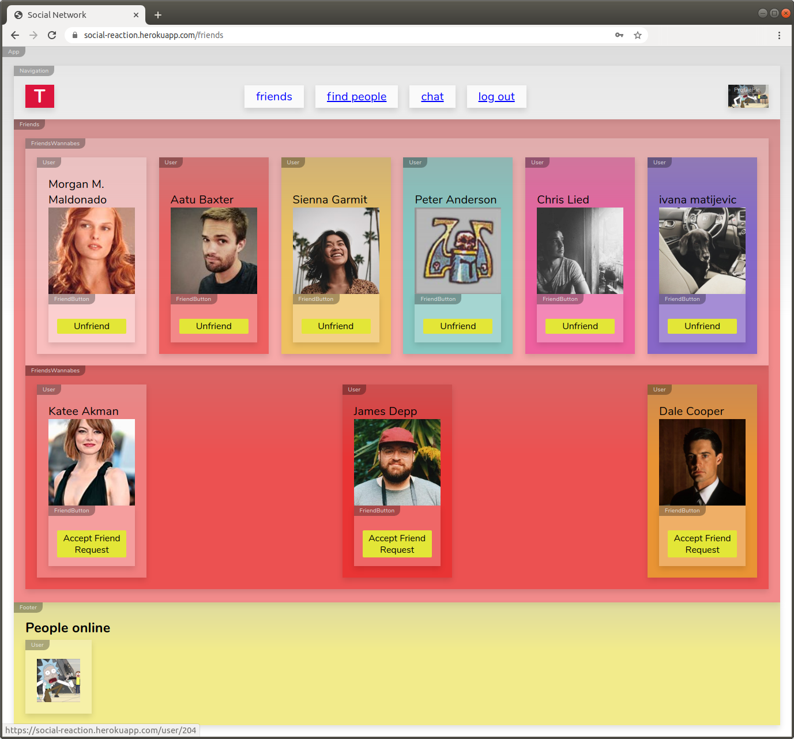

# solcial-reaction

Social Reaction is a social network and single page application created with React.

# Demo

[https://social-reaction.herokuapp.com/](https://social-reaction.herokuapp.com/)

# Cause

Social Reaction is a social network and single page application created with React. Users can log in, tell a little about themselves and make friends with other users. It includes: registration, validation, log-in, profile search, instant chat and more. One of the things I focused on during the implementation was making the component structure of React visible.

# Key Features

-   SPA
-   Registration /Login /Reset Password
-   Account validation by email via AWS SES
-   User profile editing (profile bio + pic)
-   Image Upload using AWS S3 bucket
-   Find for other users and display their profiles
-   Make friend requests / cancel friend requests / reject friend requests / end friendships
-   List of Users Online
-   Instant Chat using WebSockets (socket.io)
-   State management with Redux

# In Development

-   full mobile compatible Version

# Technologies used

-   JavaScript
-   React.js
-   Redux
-   Socket.io
-   Node.js/Express
-   PostgreSQL
-   AWS S3, IAM, SES
-   Jest, React Testing Library
-   HTML, CSS
